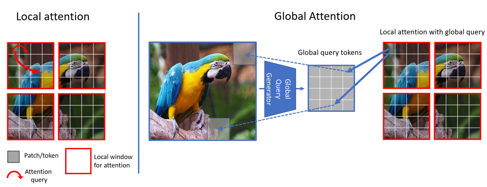
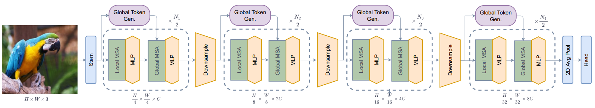
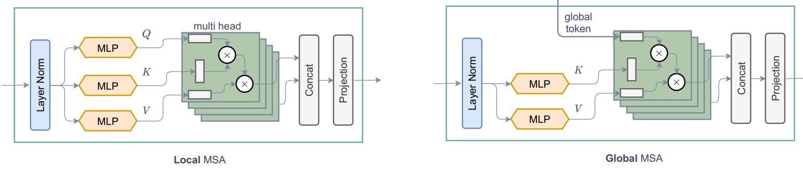
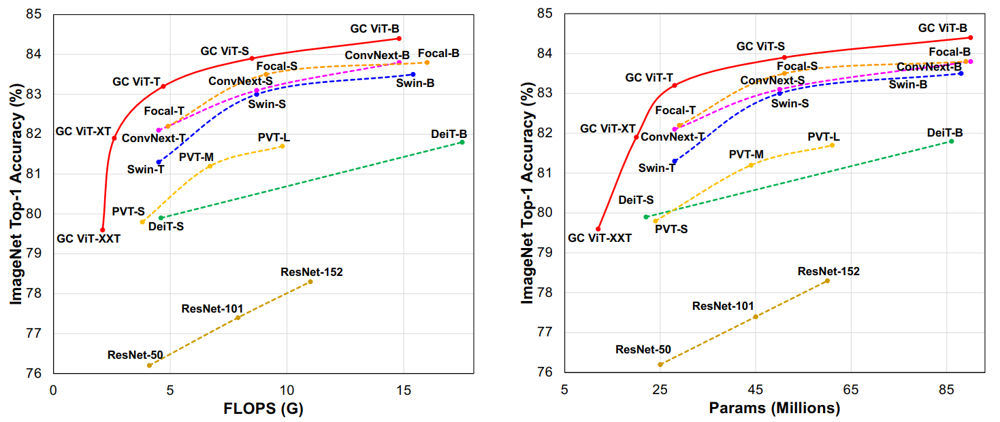

<h1 align="center">
<p><a href='https://arxiv.org/pdf/2206.09959v1.pdf'>GCViT: Global Context Vision Transformer</a></p>
</h1>
<div align=center></div>
<p align="center">
<a href="https://github.com/TensorSpeech/TensorFlowASR/blob/main/LICENSE">
  
</a>


<h2 align="center">
<p>Tensorflow 2.0 Implementation of GCViT</p>
</h2>
</p>
<p align="center">
This library implements <b>GCViT</b> using Tensorflow 2.0 specifally in <code>tf.keras.Model</code> manner to get PyTorch flavor.
</p>

## Model
* Architecture:


* Local Vs Global Attention:


## Result
> The reported result in the paper is shown in the figure. But due to issues in the **codebase** actual result differs from the reported result.



## Installation
```shell
pip install gcvit_tf
```

## Usage
```py
from gcvit import GCVitTiny
```

## To Do
- [ ] Port weights from official repo

## Acknowledgement
* [GCVit](https://github.com/NVlabs/GCVit) (Official)
* [Swin-Transformer-TF](https://github.com/rishigami/Swin-Transformer-TF)
* [tfgcvit](https://github.com/shkarupa-alex/tfgcvit/tree/develop/tfgcvit)
* [keras_cv_attention_models](https://github.com/leondgarse/keras_cv_attention_model)