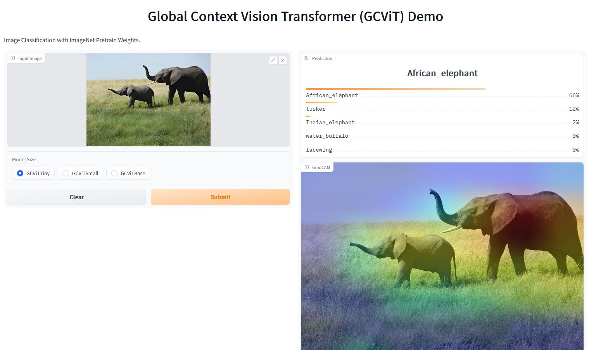

<h1 align="center">
<p><a href='https://arxiv.org/pdf/2206.09959v1.pdf'>GCViT: Global Context Vision Transformer</a></p>
</h1>
<div align=center></div>
<p align="center">
<a href="https://github.com/awsaf49/gcvit-tf/blob/main/LICENSE.md">
  
</a>


<div align=center><p>
<a target="_blank" href="https://huggingface.co/spaces/awsaf49/gcvit-tf"></a>
<a href="https://colab.research.google.com/github/awsaf49/gcvit-tf/blob/main/notebooks/GCViT_Flower_Classification.ipynb" target="_parent"></a>
<a href="https://www.kaggle.com/awsaf49/flower-classification-gcvit-global-context-vit"></a>
</p></div>
<h2 align="center">
<p>Tensorflow 2.0 Implementation of GCViT</p>
</h2>
</p>
<p align="center">
This library implements <b>GCViT</b> using Tensorflow 2.0 specifally in <code>tf.keras.Model</code> manner to get PyTorch flavor.
</p>


## Model
* Architecture:


* Local Vs Global Attention:


## Result
> The reported result in the paper is shown in the figure. But due to issues in the **codebase** actual result differs from the reported result.


## Installation
```bash
pip install -U gcvit
# or
# pip install -U git+https://github.com/awsaf49/gcvit-tf
```

## Usage
Load model using following codes,
```py
from gcvit import GCViTTiny
model = GCViTTiny(pretrain=True)
```
Simple code to check model's prediction,
```py
from skimage.data import chelsea
img = tf.keras.applications.imagenet_utils.preprocess_input(chelsea(), mode='torch') # Chelsea the cat
img = tf.image.resize(img, (224, 224))[None,] # resize & create batch
pred = model(img).numpy()
print(tf.keras.applications.imagenet_utils.decode_predictions(pred)[0])
```
Prediction:
```py
[('n02124075', 'Egyptian_cat', 0.9194835),
('n02123045', 'tabby', 0.009686623), 
('n02123159', 'tiger_cat', 0.0061576385),
('n02127052', 'lynx', 0.0011503297), 
('n02883205', 'bow_tie', 0.00042479983)]
```
For feature extraction:
```py
model = GCViTTiny(pretrain=True)  # when pretrain=True, num_classes must be 1000
model.reset_classifer(num_classes=0, head_act=None)
feature = model(img)
print(feature.shape)
```
Feature:
```py
(None, 512)
```
For feature map:
```py
model = GCViTTiny(pretrain=True)  # when pretrain=True, num_classes must be 1000
feature = model.forward_features(img)
print(feature.shape)
```
Feature map:
```py
(None, 7, 7, 512)
```

## Live-Demo
* For live demo on Image Classification & Grad-CAM, with **ImageNet** weights, click <a target="_blank" href="https://huggingface.co/spaces/awsaf49/gcvit-tf"></a> powered by 🤗 Space and Gradio. here's an example,

<a href="https://huggingface.co/spaces/awsaf49/gcvit-tf"></a>

# Example
For working training example checkout these notebooks on **Google Colab** <a href="https://colab.research.google.com/github/awsaf49/gcvit-tf/blob/main/notebooks/GCViT_Flower_Classification.ipynb" target="_parent"></a> & **Kaggle** <a href="https://www.kaggle.com/awsaf49/flower-classification-gcvit-global-context-vit"></a>.

Here is grad-cam result after training on Flower Classification Dataset,


## To Do
- [x] Working training example in Colab & Kaggle.
- [x] GradCAM showcase.
- [x] Gradio Demo.
- [x] Build model with `tf.keras.Model`.
- [x] Port weights from official repo.
- [x] Support for `TPU`.

## Acknowledgement
* [GCVit](https://github.com/NVlabs/GCVit) (Official)
* [Swin-Transformer-TF](https://github.com/rishigami/Swin-Transformer-TF)
* [tfgcvit](https://github.com/shkarupa-alex/tfgcvit/tree/develop/tfgcvit)
* [keras_cv_attention_models](https://github.com/leondgarse/keras_cv_attention_model)


## Citation
```bibtex
@article{hatamizadeh2022global,
  title={Global Context Vision Transformers},
  author={Hatamizadeh, Ali and Yin, Hongxu and Kautz, Jan and Molchanov, Pavlo},
  journal={arXiv preprint arXiv:2206.09959},
  year={2022}
}
```
